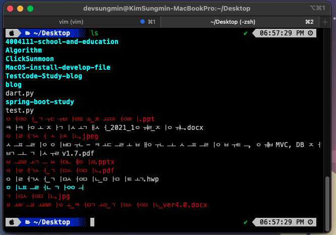
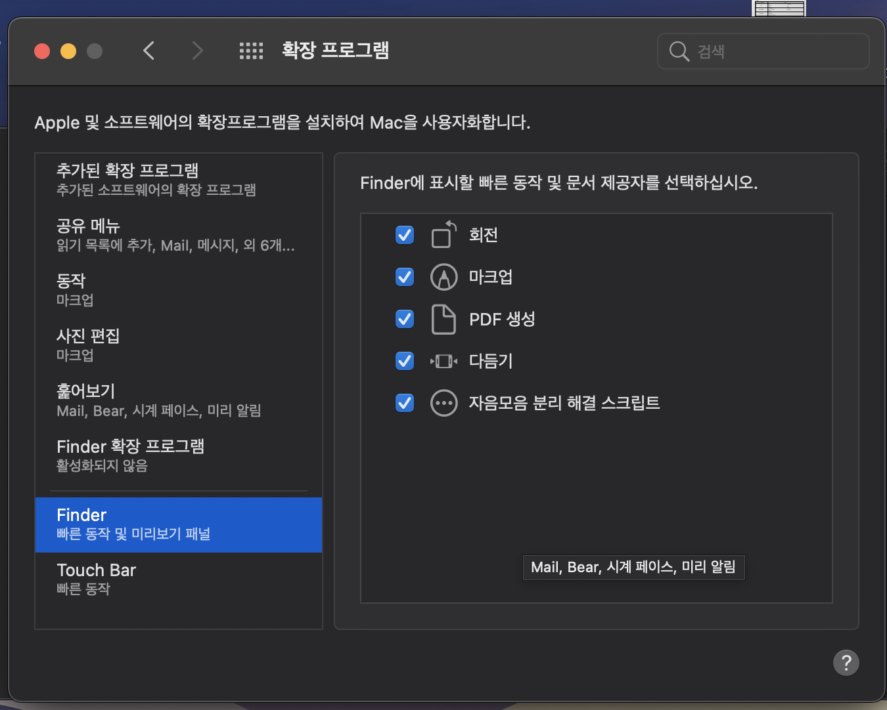
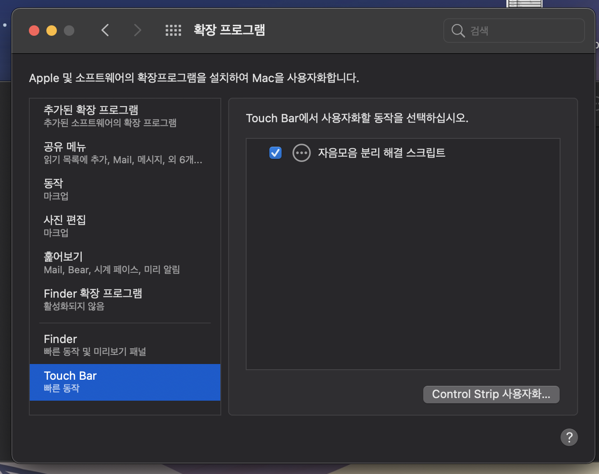
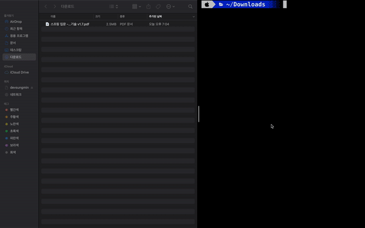

```
맥북을 쓰다보면 한글의 자음과 모음이 분리되는 문제가 있습니다.
특히 맥북에서 생성한 파일 이름을 윈도우 환경에서 사용하는 경우 많이 발생합니다.

해당 파일은 자음+모음이 분리되는 문제를 해결하는 파일로 한글에 발생하는 문제이기 때문에 한글로 작성합니다.
```


# 설치법
1. 본 스크립트는 brew 패키지에 있는  `convmv`을 사용합니다. **본 레파지토리를 다운 받아 설치하신 분은 Brewfile에 추가 되어 있으니 따로 설치를 안하셔도 됩니다.**
2. `$ brew install convmv`
3. `자음 모음 분리 해결 스크립트.workflow`파일을 더블 클릭하여 맥북에 설치해줍니다.
4. 설치가 완료되면 확장 파일로 사용할 수 있도록 체크해줍니다.
   
   

# 사용 방법

1. 스크립트를 진행할 *파일* 마우스 `우클릭`
2. `빠른동작`
3. `스크립트 클릭`
4. 파일 확인